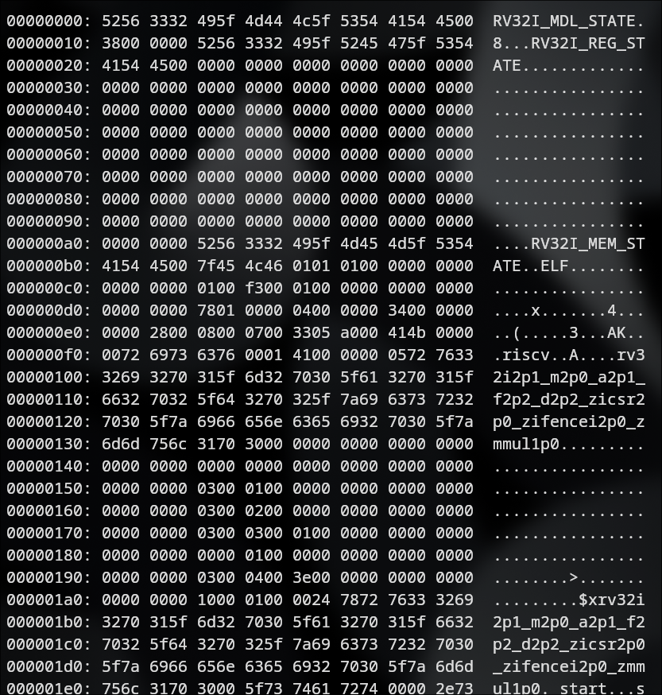

# RVSim - RISCV32i functional simulator

## Install and build

Follow these steps to install the project

### 0. Prerequisites

See [`.github/workflows/workflow.yml`](https://github.com/UjeNeTORT/rvsim/blob/main/.github/workflows/workflow.yml)
for the list of prereqs. Sorry for inconvenience!

### 1. Clone the repository

```bash
git clone https://github.com/UjeNeTORT/rvsim
```

### 2. Build the project

... using script
```bash
cd rvsim
chmod +x build.sh
./build.sh build_sh Release
```

*You can also build manually following the steps from the script if you need something specific*

### 3. Test everything (optional)

```bash
cd build_sh
./test
```

### 4. Run simulator on some examples

```bash
./rvsim --istate=../test/insn/add/001.bstate --ostate=001.bstate
```

You will see something like this:


It basically says that it started executing at some PC,
prints a trace of all decoded instructions it executed and upon encountering an unknown one it stops the execution and prints its PC.

(I will rework the exiting logic soon)

## `.bstate` ???
> Let me clarify what `.bstate` is:

`.bstate` is a file format which stores a simulator state in binary format

It can be examined with `xxd` utility, or `hexdump`, or any other hex viewer.

You will see something like this:



This file stores:
1. position of PC
2. registers
3. memory state

It also contains some signatures to make it easier to read (each one is 16 bytes) and to protect it to a certain extent.

First signature is a general one,
after it there are 4 bytes for PC value, after PC there is a registers section with its own signature and the last section is a full memory dump.

#### Generating `.bstate` from assembly sourse

Nobody wants to write such a file manually. Luckily, we have a script at [`test/script/testgen.sh`](https://github.com/UjeNeTORT/rvsim/blob/main/test/script/testgen.sh)
which is designed to address this issue.

*Lets use it!*

```bash
cd test/script/
./testgen.sh ../insn/add/src/001.s > ../../deleteme.bstate
```
The above example compilers `001.s` into
an object file, mixes it up with registers
(*`test/scripts/regs_zero.bin` - all
registers = 0 by default*) and adds
signatures. The result is `deleteme.bstate` file
which can be executed on simulator after that. Nasty workaround it was while ELFs were not supported.

## ELF files - now they are

To run simulator on an ELF file do:

```bash
./rvsim --elf=../test/elf/plus.elf
```

Simulator reads ELF using [ELFIO library](https://github.com/serge1/ELFIO).

However, **it is not as clever as i want it to be** to this point. For example, it requires linking with
`--no-relax` option because i have not supported proper `gp` register initialization based on ELF file yet (but i am going to).

That is the reason why i strongly recommend using my script
[`test/script/mkelf.sh`](https://github.com/UjeNeTORT/rvsim/blob/main/test/script/mkelf.sh)
which enables all the necessary options for you. For usage example see [`test/script/README.md`](https://github.com/UjeNeTORT/rvsim/blob/main/test/script/README.md)
